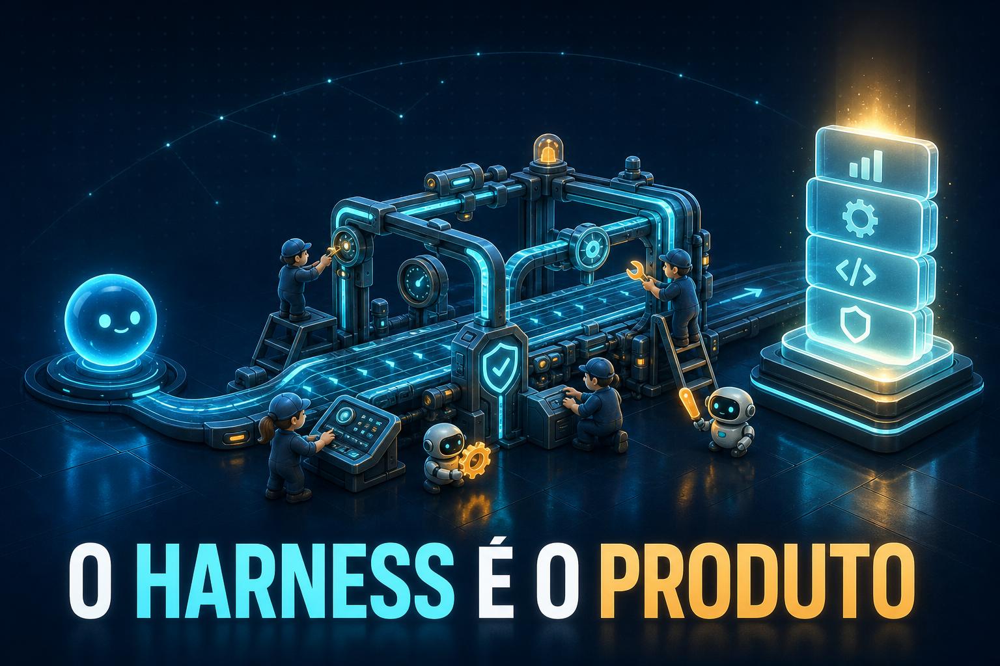

<p align="center">
  
</p>

<h1 align="center">Agente de Postagens 2.0</h1>
<p align="center">
  <strong>Workspace de publicações técnicas para LinkedIn — do tema ao pronto-para-publicar.</strong><br>
  <em>O harness é o produto, não a IA.</em>
</p>

<p align="center">
  
  
  
  
  
</p>

---

## Filosofia

> **O harness é o produto, não a IA.** Este workspace é o **harness**: a engenharia
> ao redor do modelo que torna a publicação **repetível** e de **alta qualidade**.
> A IA executa; este repo garante que ela execute bem.

Base de produção de posts de conteúdo técnico para LinkedIn. Perfil do autor:
**Tech Lead / Product Builder focado em IA**.
Foco editorial: **Arquitetura de Software · Engenharia de Dados/AI · DevOps & CI/CD**.

---

## Sumário

- [Como usar em 5 passos](#como-usar-em-5-passos)
- [Galeria de publicações](#galeria-de-publicações)
- [O pipeline (A→H)](#o-pipeline-ah)
- [Estrutura de pastas](#estrutura-de-pastas)
- [Documentação essencial](#documentação-essencial-leia-na-ordem)
- [Golden example (a régua do pronto)](#golden-example-a-régua-do-pronto)
- [Diferença do v1](#diferença-do-v1-agente-postagens)
- [Segurança](#segurança)

---

## Como usar em 5 passos

1. **Abra este workspace** num agente de IA (Kilo Code, etc.) que tenha os MCPs
   `zai-search`, `zai-reader`, `zai-zread`, `zai-vision` e `playwright`/`kilo-playwright`.
2. **Invoque o agente** `.kilo/agent/publicacoes.md` (ou leia `AGENTS.md` e siga o pipeline).
3. **Diga o tema** (ou peça para o agente propor um a partir de `ideias-futuras/backlog-posts.md`).
4. O agente executa as **Fases A→H** (ver `PIPELINE.md`) e entrega dois arquivos:
   - `posts-linkedin/NN-<slug>.md` — versão densa (demonstra domínio técnico)
   - `posts-linkedin/NNb-<slug>.md` — versão **humana, pronta para publicar** ← _entregável principal_
5. **Publique** a versão `NNb` junto com a imagem aprovada em `posts-linkedin/imagens/<slug>/`.

---

## Galeria de publicações

Cada post gera **duas** versões (`NN-` densa + `NNb-` humana) e uma imagem gerada
por **OpenAI `gpt-image-2`** (Tier 0), validada por um juiz de visão (gate `score ≥ 8`).

| # | Publicação | Denso | Humano (publicar) | Imagem |
|---|-----------|:-----:|:-----------------:|:-----:|
| 01 | Dívida técnica virou prompt | [NN](posts-linkedin/01-technical-debt-prompt.md) | [NNb](posts-linkedin/01b-technical-debt-prompt.md) |  |
| 02 | Context engineering | [NN](posts-linkedin/02-context-engineering.md) | [NNb](posts-linkedin/02b-context-engineering.md) |  |
| 03 | Eval-driven development | [NN](posts-linkedin/03-eval-driven-dev.md) | [NNb](posts-linkedin/03b-eval-driven-dev.md) |  |
| 04 | GIL & agentes autônomos | [NN](posts-linkedin/04-gil-agentes.md) | [NNb](posts-linkedin/04b-gil-agentes.md) |  |
| 05 | Memory poisoning | [NN](posts-linkedin/05-memoria-poisoning.md) | [NNb](posts-linkedin/05b-memoria-poisoning.md) |  |
| 06 | Vibe coding & integration debt | [NN](posts-linkedin/06-vibe-fast-integration-debt.md) | [NNb](posts-linkedin/06b-vibe-fast-integration-debt.md) |  |
| 07 | Master manual anti-vibe | [NN](posts-linkedin/07-master-manual-anti-vibe.md) | [NNb](posts-linkedin/07b-master-manual-anti-vibe.md) |  |

> Capa de perfil LinkedIn (4:1) pronta: [`posts-linkedin/imagens/capa-linkedin-banner/`](posts-linkedin/imagens/capa-linkedin-banner/)

---

## O pipeline (A→H)

```
A  Pesquisa        fontes + ângulo unificador         → pesquisas/NN-slug.md
B  Redação         post denso (domínio técnico)        → posts-linkedin/NN-slug.md
C  Conceito img    conceito-primeiro (NÃO prompt-first) → ferramentas/conceitos/NN.txt
D  Geração img     Tier 0 OpenAI gpt-image-2 → fallback → posts-linkedin/imagens/<slug>/
E  Validação       juiz de visão (rubric, gate ≥ 8)    → iterar (máx 4×, best-of-N)
G  Empacotar       imagem + alt-text + notas + backlog
H  Humanizar       versão HUMANA, PRONTO PARA PUBLICAR  → posts-linkedin/NNb-slug.md  ★ entregável principal
```

**Definition of Done:** (1) `NN-` denso completo, (2) `NNb-` humano completo marcado
*"Pronto para publicar"*, (3) imagem com `score ≥ 8` **E** `value_demonstrated`, (4) alt-text,
(5) backlog atualizado. Passo a passo completo em [`PIPELINE.md`](PIPELINE.md).

---

## Estrutura de pastas

```
agente-postagens-2/
├─ README.md                  # este arquivo (visão + como usar)
├─ AGENTS.md                  # 📌 DOC PARA A IA ler primeiro (harness, perfil, pipeline, regras)
├─ PERFIL-EDITORIAL.md        # voz/tom/áreas/hashtags + MODO DUPLO (denso + humano)
├─ PIPELINE.md                # Fases A→H passo a passo + rubric de imagem + Definition of Done
├─ MODELO-POST.md             # templates em branco (NN- denso e NNb- humano)
├─ docs/                      # assets do README (capa)
│
├─ .kilo/agent/publicacoes.md # prompt do agente (harness enxuto → aponta p/ os docs acima)
│
├─ ferramentas/               # CURADO — só o que funciona
│  ├─ README.md               # índice das ferramentas
│  ├─ gerar-imagem-openai.mjs # Tier 0 OpenAI (texto perfeito) — DEFAULT
│  ├─ gerar-imagem.mjs        # multi-backend (kilo/gemini/zai/pollinations) — fallbacks
│  ├─ gemini-gen.mjs          # Tier 1 Gemini via Chrome logado
│  ├─ web-sourcing.mjs        # Tier 2 imagem CC (Openverse)
│  ├─ conceitos/              # concept-briefs por post (NN-slug.txt)
│  └─ runbooks/               # como usar cada ferramenta
│     ├─ imagem-tiers.md      # hierarquia de tiers + troubleshooting
│     ├─ openai-imagem.md     # Tier 0 runbook + prompt-template anti-clutter
│     ├─ gemini-captura.md    # Tier 1 runbook
│     └─ pesquisa-web.md      # como pesquisar (zai-search/reader/zread)
│
├─ pesquisas/                 # saída Fase A (NN-slug.md) — fontes consolidadas por tema
├─ posts-linkedin/            # saída final (NN- denso + NNb- humano) + imagens/<slug>/
│  └─ imagens/
├─ ideias-futuras/            # backlog-posts.md
└─ package.json               # deps: playwright
```

---

## Documentação essencial (leia na ordem)

1. **[`AGENTS.md`](AGENTS.md)** — leia primeiro se for uma IA. Diz o que é o agente, a filosofia,
   onde está o golden example e o que nunca fazer.
2. **[`PERFIL-EDITORIAL.md`](PERFIL-EDITORIAL.md)** — a voz do autor e o modo duplo denso/humano.
3. **[`PIPELINE.md`](PIPELINE.md)** — as 8 fases (A→H) do trabalho, do zero ao pronto-publicar.
4. **[`MODELO-POST.md`](MODELO-POST.md)** — copie e preencha ao criar um novo post.

---

## Golden example (a régua do pronto)

O post que o autor aprovou como o **"mais humano e perfeito"** e refinou em 20/jun/2026
vive no **v1** (não duplicado aqui):

- **Texto:** `../agente-postagens/posts-linkedin/01b-harness-engineering-resumido.md`
- **Imagem:** `../agente-postagens/posts-linkedin/imagens/harness-engineering/openai-gpt-image-2-C-engenheiros.png`
  (Tier 0 OpenAI `gpt-image-2`, conceito: mini-engenheiros montando harness, score 8.8,
  texto PT-BR "O MODELO NAO E O PRODUTO")

Use-o como **régua**: toda `NNb-` humana deve bater o nível dele (curto, metáfora
concreta, hook com dor+custo, tom de autoridade, CTA com emoji, pronto para publicar).
Gate de imagem: `clutter ≤ 6` (elevado de ≤4 em 20/jun/2026).

---

## Diferença do v1 (`../agente-postagens`)

O v1 é a **base de pesquisa original** (mantida intacta — não apague nem edite).
O 2.0 é o **harness reorganizado**: mesma filosofia, mesmas ferramentas que funcionam,
mas documentado, curado e com a **Fase H (humanização)** formalizada como entregável
obrigatório. Pesquisas/posts do v1 são referência — o 2.0 começa sua própria numeração (`01-`).

---

## Segurança

- **Nunca** commitar chaves de API (`OPENAI_API_KEY`, `KILO_API_KEY`, `GEMINI_API_KEY`,
  `ZAI_API_KEY`). Use variável de ambiente do Windows:
  ```powershell
  [Environment]::SetEnvironmentVariable("OPENAI_API_KEY","sk-proj-...","User")  # persiste
  $env:OPENAI_API_KEY="sk-proj-..."                                             # só nesta sessão
  ```
- Nunca insira credenciais do usuário em automação de browser.
- `.gitignore` cobre `.env`, perfis de browser e `node_modules`.

---

<sup>Capa gerada com OpenAI <code>gpt-image-2</code> (Tier 0), conceito "harness + squad". Validada por juiz de visão: score 8.5 · clutter 6 · fidelity 10 · texto PT-BR correto.</sup>
